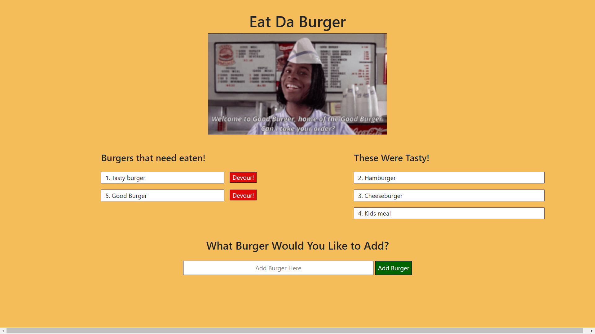

# Eat Da Burger!

## App Description:

### Eat Da Burger is a full-stack burger logger that utilizes MySQL, Node, Express, Twitter Bootstrap, Handlebars and a homemade ORM. The MVC design pattern was followed, Node and MySQL to query and route data in this app, and Handlebars to generate the HTML.

## Demo:

### Eat Da Burger is deployed on Heroku. Please, [click here](https://lit-waters-98789.herokuapp.com/) to demo this app.

## Run Locally:

### First, clone this repository by running this in your terminal

        git clone https://github.com/aidanclemente/burger.git

Second, move into the burger directory and install the necessary dependencies:

        cd burger
        npm install

Then, run server.js using node:

        node server.js

Lastly, open your browser of choice and for the URL insert:

        localhost:3000

All that's left is to devour burgers until your heart's content!